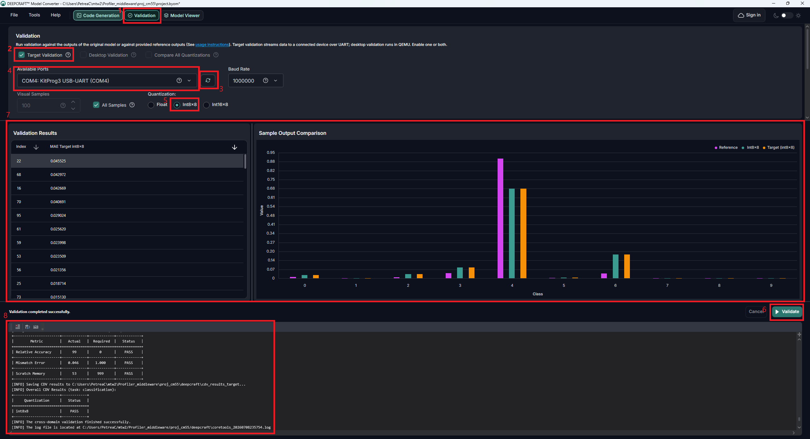

# PSOC&trade; Edge MCU: DEEPCRAFT&trade; Machine learning profiler

This code example demonstrates how to use the DEEPCRAFT&trade; development flow on PSOC&trade; Edge MCU, where you can have a pre-trained neural network (NN) model, which can be profiled and validated by the target device.

Import a pre-trained model using the DEEPCRAFT&trade; Model Converter – installed through [Infineon Developer Center](https://softwaretools.infineon.com/assets/software) – and create an embedded, optimized version of this model. During generation, the test data that was passed into the tool are generated as *.c*/*.h* files, which are then integrated with the code example. This lets you profile the model performance with test data when deployed on the PSOC&trade; Edge MCU. You can also select where to deploy and run the model:

- **High-performance domain:** Uses Arm&reg; Cortex&reg;-M55 and the Ethos-U55 processor

- **Low-power domain:** Uses Arm&reg; Cortex&reg;-M33 and the NNLITE processor

View the [DEEPCRAFT&trade; Model Converter documentation](https://developer.imagimob.com/deepcraft-model-converter)

[View this README on GitHub.](https://github.com/Infineon/mtb-example-psoc-edge-ml-deepcraft-profiler)

[Provide feedback on this code example.](https://yourvoice.infineon.com/jfe/form/SV_1NTns53sK2yiljn?Q_EED=eyJVbmlxdWUgRG9jIElkIjoiQ0UyNDIwMzgiLCJTcGVjIE51bWJlciI6IjAwMi00MjAzOCIsIkRvYyBUaXRsZSI6IlBTT0MmdHJhZGU7IEVkZ2UgTUNVOiBERUVQQ1JBRlQmdHJhZGU7IE1hY2hpbmUgbGVhcm5pbmcgcHJvZmlsZXIiLCJyaWQiOiJuaWNob2xhcy5zaGFycEBpbmZpbmVvbi5jb20iLCJEb2MgdmVyc2lvbiI6IjIuMC4wIiwiRG9jIExhbmd1YWdlIjoiRW5nbGlzaCIsIkRvYyBEaXZpc2lvbiI6Ik1DRCIsIkRvYyBCVSI6IklDVyIsIkRvYyBGYW1pbHkiOiJQU09DIn0=)

See *[Design and implementation](docs/design_and_implementation.md)* for the functional description of this code example.

## Requirements

- [ModusToolbox&trade;](https://www.infineon.com/modustoolbox) v3.7 or later (tested with v3.7)
- [DEEPCRAFT&trade; Model Converter](https://www.infineon.com/design-resources/embedded-software/deepcraft-edge-ai-solutions/deepcraft-model-converter)
- Board support package (BSP) minimum required version: 1.0.0
- Programming language: C
- Associated parts: All [PSOC&trade; Edge MCU](https://www.infineon.com/products/microcontroller/32-bit-psoc-arm-cortex/32-bit-psoc-edge-arm) parts

## Supported toolchains (make variable 'TOOLCHAIN')

- GNU Arm&reg; Embedded Compiler v14.2.1 (`GCC_ARM`) – Default value of `TOOLCHAIN`
- Arm&reg; Compiler v6.22 (`ARM`)
- LLVM Embedded Toolchain for Arm&reg; v19.1.5 (`LLVM_ARM`)

> **Notes:**
> - IAR is not supported by TensorFlow Lite for Microcontrollers (TFLM) library.
> - This code example currently supports the VFP_SELECT option "hardfp" only. Setting "softfp" may cause build failure.

## Supported kits (make variable 'TARGET')

- [PSOC&trade; Edge E84 Evaluation Kit](https://www.infineon.com/KIT_PSE84_EVAL) (`KIT_PSE84_EVAL_EPC2`) – Default value of `TARGET`
- [PSOC&trade; Edge E84 Evaluation Kit](https://www.infineon.com/KIT_PSE84_EVAL) (`KIT_PSE84_EVAL_EPC4`)
- [PSOC&trade; Edge E84 AI Kit](https://www.infineon.com/KIT_PSE84_AI) (`KIT_PSE84_AI`)

## Hardware setup

This example uses the board's default configuration. See the kit user guide to ensure that the board is configured correctly.

Ensure the following jumper and pin configuration on board.
- BOOT SW must be in the HIGH/ON position
- J20 and J21 must be in the tristate/not connected (NC) position

> **Note:** This hardware setup is not required for KIT_PSE84_AI.

## Software setup

See the [ModusToolbox&trade; tools package installation guide](https://www.infineon.com/ModusToolboxInstallguide) for information about installing and configuring the tools package.

Install a terminal emulator if you do not have one. Instructions in this document use [Tera Term](https://teratermproject.github.io/index-en.html).

By default, the *Makefile* file for Arm&reg; Cortex&reg;-M55 and Arm&reg; Cortex&reg;-M33 uses a model that comes with the code example. The pre-trained NN model is located in the *pretrained_models* folder. You can use the DEEPCRAFT&trade; Model Converter tool to link to this file or load another model file and generate C files for the target device.

- ***proj_cm55/Makefile:*** Uses the `RESNET` model located at *proj_cm55/pretrained_models/*
- ***proj_cm33_ns/Makefile:*** Uses the `SMALL_MLP_MNIST` model located at *proj_cm33_ns/pretrained_models/*

By default, the output file location is set to *deepcraft*. The project name is set to *TEST_MODEL*. If you change any of these default settings, edit the following *Makefile* parameters of this code example:

**Table 1. Makefile parameters** 
 
 Makefile parameter | Description
 :--------          | :--------
 `NN_MODEL_NAME=`   | Defines the name of the model. The name comes from the *Output File Name* defined in DEEPCRAFT&trade; Model Converter. Do not use quotes when changing the name of the model
 `NN_MODEL_FOLDER=` | Sets the name where the model files is placed. The name comes from the *Output Directory* defined in DEEPCRAFT&trade; Model Converter
 `NN_TYPE`          | Defines the data type of the model input data and weights. It has three options: `float`, `int8x8`, or `int16x8`. Must match the type generated by DEEPCRAFT&trade; Model Converter
 `NN_INFERENCE_ENGINE` | Defines the inference engine to run. It has two options: `tflm` or `tflm_less`. If the model was converted with the **Interpreterless** option enabled in DEEPCRAFT&trade; Model Converter, set this to `tflm_less`. Note that Ethos-U55 does not support the `tflm_less` option
 `NN_NPU_ENABLE`    | Enables the NNLITE NPU (only available for the CM33 project)
 `NN_RNN_MODEL`     | Set to `yes` when profiling a recurrent (RNN/streaming) model, `no` otherwise. Enables the `RNN_STREAMING` handling in the validation task

 

The regression data can either be compiled into the firmware or streamed from the host at runtime. This is controlled by the `ML_VALIDATION_SOURCE` parameter in *common.mk*.

**Table 2. Validation source parameter (common.mk)**

 Makefile parameter | Description
 :--------          | :--------
 `ML_DEEPCRAFT_CPU` | Selects the core that runs the profiler: `cm33` or `cm55`
 `ML_VALIDATION_SOURCE` | Selects where the regression data comes from: `local` (test data compiled into the firmware) or `stream` (data streamed over UART from the DEEPCRAFT&trade; Model Converter "Validate on Target" feature)

 

When `ML_VALIDATION_SOURCE=stream`, the device does not store the regression data. Instead, it waits for the DEEPCRAFT&trade; Model Converter to stream the input samples over UART, runs the inference, and streams the outputs back so the tool can compute the accuracy. In this mode the UART baud rate is raised to 1 Mbps automatically; for `local` validation the terminal uses 115200 baud. When `local` validation is used, the device also reports per-output classification accuracy and the Mean Absolute Error (MAE) between the model output and the reference data.

The kind of profiling performed is controlled by the `PROFILE_CONFIGURATION` macro in *shared_src/ml_profiler.c*:

- `MTB_ML_PROFILE_DISABLE` – disable profiling
- `MTB_ML_PROFILE_ENABLE_MODEL` – profile the model (default)
- `MTB_ML_LOG_ENABLE_MODEL_LOG` – enable the model profiling log

 

There are two *project.byom* files in this code example. These are the configuration files for the DEEPCRAFT&trade; Model Converter for each project:
- *proj_cm55/project.byom*
- *proj_cm33_ns/project.byom*

1. Choose one of these files and open it with the DEEPCRAFT&trade; Model Converter tool
2. To generate source code for a given model with the tool, click the **Start** button. By default, the project uses the testing data stored in the file located at *sample_data/* folder. 

   If you check **Enable model quantization**, the project uses calibration data stored in the file also located at the *sample_data/* folder

## Operation

See [Using the code example](docs/using_the_code_example.md) for instructions on creating a project, opening it in various supported IDEs, and performing tasks, such as building, programming, and debugging the application within the respective IDEs.

1. Connect the board to your PC using the provided USB cable through the KitProg3 USB connector

2. In *common.mk*, set `ML_DEEPCRAFT_CPU` as 'cm33' or 'cm55'. You must profile only the model for the given core. Also set `ML_VALIDATION_SOURCE` to 'local' or 'stream'

3. Program the board

4. Run the validation:

   - **Local validation** (`ML_VALIDATION_SOURCE=local`): Open a terminal program and select the KitProg3 COM port. Set the serial port parameters to '8N1' and '115200' baud. After programming, the application starts automatically. Confirm that "PSOC Edge MCU: Machine Learning DEEPCRAFT Profiler", model information, profiling data, per-output accuracy, and MAE results are printed on the UART terminal

   **Figure 1. Terminal output using local validation**

   

   - **Streaming validation** (`ML_VALIDATION_SOURCE=stream`): Do not open a terminal on the KitProg3 COM port. Instead, in the DEEPCRAFT&trade; Model Converter, use the **Validate on Target** feature to stream the regression data over UART (1 Mbps). The tool sends the input samples, the device runs the inference and streams the outputs back, and the tool reports the accuracy

   **Figure 2. DEEPCRAFT&trade; Model Converter using stream validation on target**

   

   In the DEEPCRAFT&trade; Model Converter:

   1. Open the **Validation** tab in the top navigation bar
   2. Enable the **Target Validation** checkbox to activate on-device streaming validation
   3. Use the refresh button next to the **Available Ports** selector.
   4. Under **Available Ports**, select the KitProg3 COM port (ensure no other application has it open). 
   5. Under **Quantization**, select the quantization type that matches the `NN_TYPE` set in the *Makefile* and currently running on the connected board(e.g. `int8x8`)
   6. Click **Validate** to start — the tool streams the regression data to the device over UART and collects the inference outputs
   7. The **Validation Results** panel (left) shows the per-sample MAE, and the **Sample Output Comparison** chart (right) plots the reference and target outputs side by side
   8. The **console** at the bottom of the window shows the final pass/fail metrics (classification accuracy, mismatched error, scratch memory) and log messages when validation completes successfully

## Related resources

Resources  | Links
-----------|----------------------------------
Application notes  | [AN235935](https://www.infineon.com/AN235935) – Getting started with PSOC&trade; Edge E8 MCU on ModusToolbox&trade; software
Code examples  | [Using ModusToolbox&trade;](https://github.com/Infineon/Code-Examples-for-ModusToolbox-Software) on GitHub
Device documentation | [PSOC&trade; Edge MCU datasheets](https://www.infineon.com/products/microcontroller/32-bit-psoc-arm-cortex/32-bit-psoc-edge-arm#documents)   [PSOC&trade; Edge MCU reference manuals](https://www.infineon.com/products/microcontroller/32-bit-psoc-arm-cortex/32-bit-psoc-edge-arm#documents)
Development kits | Select your kits from the [Evaluation board finder](https://www.infineon.com/cms/en/design-support/finder-selection-tools/product-finder/evaluation-board)
Libraries  | [mtb-dsl-pse8xxgp](https://github.com/Infineon/mtb-dsl-pse8xxgp) – Device support library for PSE8XXGP   [retarget-io](https://github.com/Infineon/retarget-io) – Utility library to retarget STDIO messages to a UART port
Tools  | [ModusToolbox&trade;](https://www.infineon.com/modustoolbox) – ModusToolbox&trade; software is a collection of easy-to-use libraries and tools enabling rapid development with Infineon MCUs for applications ranging from wireless and cloud-connected systems, edge AI/ML, embedded sense and control, to wired USB connectivity using PSOC&trade; Industrial/IoT MCUs, AIROC&trade; Wi-Fi and Bluetooth&reg; connectivity devices, XMC&trade; Industrial MCUs, and EZ-USB&trade;/EZ-PD&trade; wired connectivity controllers. ModusToolbox&trade; incorporates a comprehensive set of BSPs, HAL, libraries, configuration tools, and provides support for industry-standard IDEs to fast-track your embedded application development

 

## Other resources

Infineon provides a wealth of data at [www.infineon.com](https://www.infineon.com) to help you select the right device, and quickly and effectively integrate it into your design.

## Document history

Document title: *CE242038* – *PSOC&trade; Edge MCU: DEEPCRAFT&trade; Machine learning profiler*

 Version | Description of change
 ------- | ---------------------
 1.0.0   | New code example
 1.1.0   | Added support for Multi-Input and Multi-Output (MIMO) models   Added support for TFLM Interpreter-less inferencing when using the M33   Added options to change the cache management for the Ethos-U55 in the Makefile   Added per-region profiling   Added support for MAE calculation   Added a check for unsupported build configuration
 2.0.0   | Migrated the application from the DEEPCRAFT&trade; `IMAI_*` wrapper API to calling the ML middleware directly   Added UART streaming validation (`ML_VALIDATION_SOURCE=stream`) using the DEEPCRAFT&trade; Model Converter "Validate on Target" feature   Added the `NN_TYPE` and `NN_RNN_MODEL` Makefile parameters
 

All referenced product or service names and trademarks are the property of their respective owners.

The Bluetooth&reg; word mark and logos are registered trademarks owned by Bluetooth SIG, Inc., and any use of such marks by Infineon is under license.

PSOC&trade;, formerly known as PSoC&trade;, is a trademark of Infineon Technologies. Any references to PSoC&trade; in this document or others shall be deemed to refer to PSOC&trade;.

---------------------------------------------------------

(c) 2026, Infineon Technologies AG, or an affiliate of Infineon Technologies AG. All rights reserved.

This software, associated documentation and materials ("Software") is owned by Infineon Technologies AG or one of its affiliates ("Infineon") and is protected by and subject to worldwide patent protection, worldwide copyright laws, and international treaty provisions. Therefore, you may use this Software only as provided in the license agreement accompanying the software package from which you obtained this Software. If no license agreement applies, then any use, reproduction, modification, translation, or compilation of this Software is prohibited without the express written permission of Infineon.
 
Disclaimer: UNLESS OTHERWISE EXPRESSLY AGREED WITH INFINEON, THIS SOFTWARE IS PROVIDED AS-IS, WITH NO WARRANTY OF ANY KIND, EXPRESS OR IMPLIED, INCLUDING, BUT NOT LIMITED TO, ALL WARRANTIES OF NON-INFRINGEMENT OF THIRD-PARTY RIGHTS AND IMPLIED WARRANTIES SUCH AS WARRANTIES OF FITNESS FOR A SPECIFIC USE/PURPOSE OR MERCHANTABILITY. Infineon reserves the right to make changes to the Software without notice. You are responsible for properly designing, programming, and testing the functionality and safety of your intended application of the Software, as well as complying with any legal requirements related to its use. Infineon does not guarantee that the Software will be free from intrusion, data theft or loss, or other breaches (“Security Breaches”), and Infineon shall have no liability arising out of any Security Breaches. Unless otherwise explicitly approved by Infineon, the Software may not be used in any application where a failure of the Product or any consequences of the use thereof can reasonably be expected to result in personal injury.
